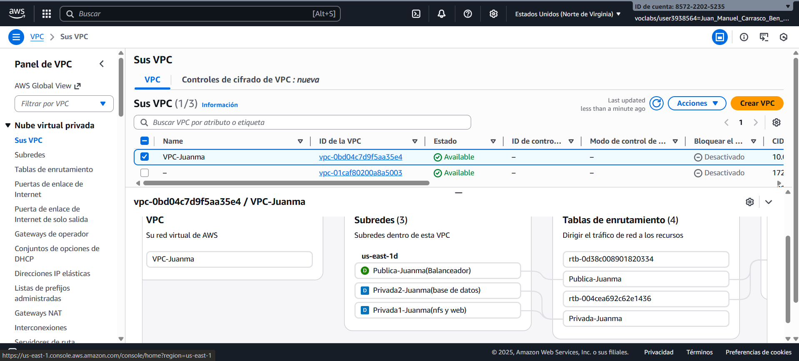
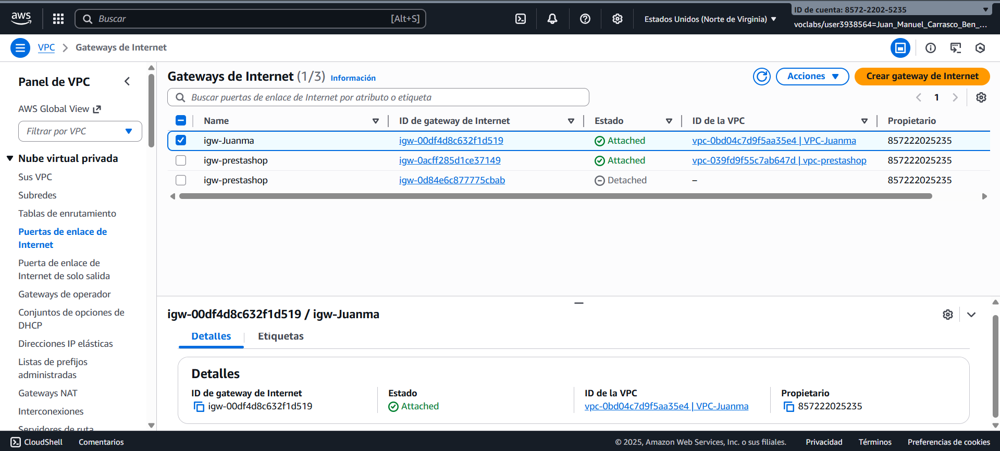
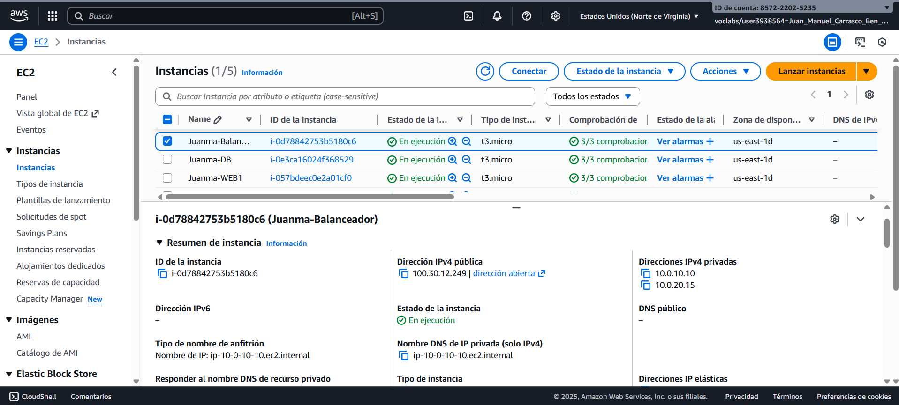
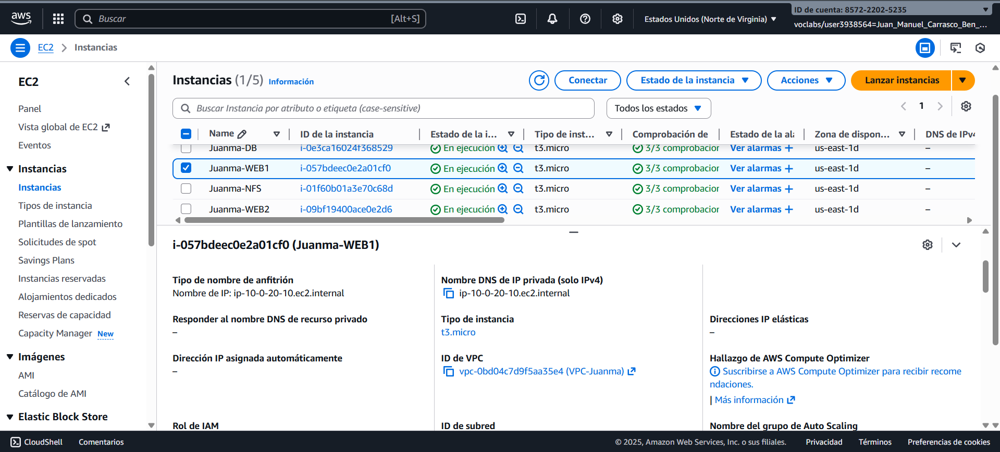
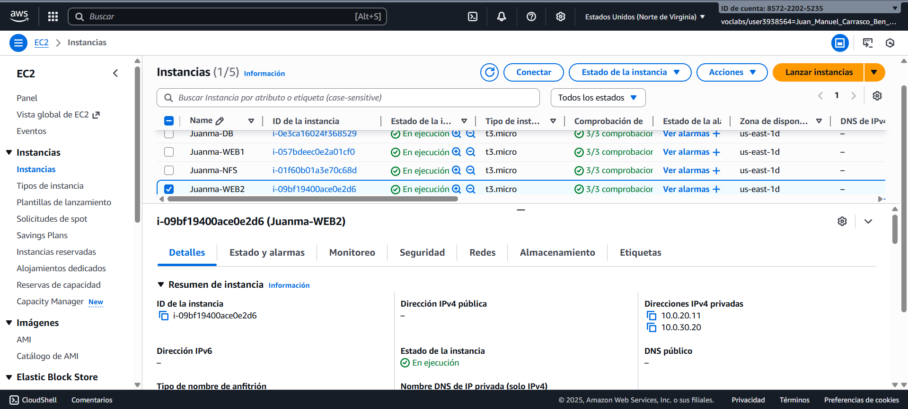
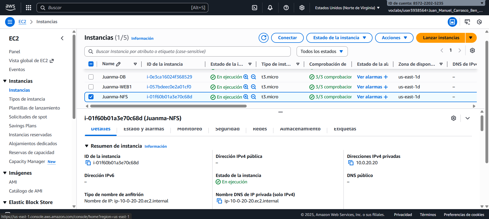
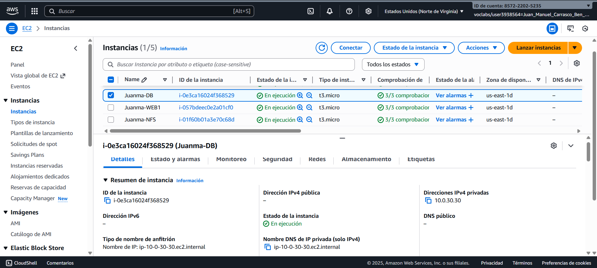

# Despliegue de CMS WordPress en Alta Disponibilidad en AWS

## Arquitectura de 3 Capas (Balanceo + Backend/NFS + Base de Datos)

**Práctica:** Despliegue de CMS WordPress en Alta Disponibilidad
**Alumno:** *Juan Manuel Carrasco Benítez*
**Curso:** ASIR II
**Fecha:** *07/12/2025*
**URL de la aplicación:** *[https://juanma-aws.sytes.net/](https://juanma-aws.sytes.net/)*

## Índice

1. Descripción General
2. Objetivos de la Práctica
3. Arquitectura General del Proyecto
4. Requisitos Previos
5. Diseño de la Infraestructura en AWS
   * 5.1. VPC y Subredes
   * 5.2. Internet Gateway
   * 5.4. Tablas de Enrutamiento
   * 5.5. Grupos de Seguridad
   * 5.6. ACLs de Red
6. Capa 1 — Balanceador de Carga (Pública)

7. Capa 2 — Backend + Servidor NFS (Privada)

8. Capa 3 — Servidor de Base de Datos (Privada)

9. Scripts de Aprovisionamiento

10. Conclusiones

## 1.Descripción General

Este proyecto consiste en el despliegue de un CMS WordPress en AWS utilizando una arquitectura de tres capas diseñada para garantizar **alta disponibilidad, seguridad y escalabilidad**. La capa pública actúa como punto de entrada mediante un balanceador Apache, la capa intermedia tiene los servidores backend y un sistema de archivos compartido mediante NFS para mantener sincronizado el contenido de la WEB. La base de datos se encuentra en una capa privada, permitiendo que únicamente los servidores web tengan acceso a ella. Gracias a esto se le agrega un nivel mayor de seguridad al eslabon más débil de la cadena(DB). Todo el entorno se despliega de manera automatizada utilizando scripts en BASH y se protege mediante grupos de seguridad y ACLs de red. Además, se integra un dominio propio y la posibilidad de habilitar HTTPS con Certbot(Lo cual se ha realizado en la practica).

## 2.Objetivos de la Práctica

* Desplegar WordPress en AWS con arquitectura distribuida en 3 capas.
* Asegurar **alta disponibilidad** mediante balanceo de carga.
* Separar funciones: balanceo, backend + almacenamiento, y base de datos para mayor seguridad.
* Realizar todo el aprovisionamiento por **scripts BASH**.
* Configurar seguridad con **grupos de seguridad y ACLs**.
* Implementar **HTTPS** sobre **dominio propio**.
* Personalizar WordPress con el nombre del alumno.

## 3.Arquitectura General del Proyecto
### Infraestructura

La infraestructura se basa en una arquitectura segmentada en **tres capas**, diseñada para mejorar la **seguridad, escalabilidad y control del entorno**. Cada capa opera en una subred específica dentro de la VPC y cumple un rol concreto: el balanceo de tráfico público, el procesamiento interno de WordPress y el almacenamiento compartido mediante NFS, así como la gestión aislada de la base de datos. Esta separación permite un **flujo ordenado, seguro y fácilmente escalable** según la carga del proyecto.

La infraestructura se ha diseñado siguiendo un modelo de **tres niveles**, donde cada capa cumple una función específica para mejorar la seguridad, el rendimiento y la tolerancia a fallos.

* **Capa pública — Balanceador:** Gestiona el tráfico entrante y distribuye las peticiones hacia los servidores internos. Es la única parte accesible desde Internet.
* **Capa privada — Backend + NFS:** Aquí residen los servidores web que ejecutan WordPress y un servidor NFS encargado de almacenar el contenido compartido. Ambos nodos utilizan el mismo directorio compartido para mantener coherencia.
* **Capa privada — Base de Datos:** Contiene el motor MySQL/MariaDB. Está completamente aislada y solo acepta conexiones provenientes de la capa de backend.

Este diseño garantiza que el acceso externo nunca llega directamente a los servidores web o a la base de datos, manteniendo una separación clara entre las capas y reduciendo la superficie de ataque.

## Esquema Visual de la Infraestructura

                   ┌───────────────────────────┐
                   │       Internet Pública     │
                   └───────────────┬───────────┘
                                   │
                        IP Elástica / Dominio
                                   │
                   ┌───────────────▼───────────────┐
                   │  Capa 1: Balanceador (Apache)  │
                   │        SG: Público/443         │
                   └───────────────┬───────────────┘
                                   │  Sólo tráfico HTTP/HTTPS
                           ┌───────┴──────────────────────┐
                           │                              │
              ┌────────────▼───────────┐     ┌────────────▼───────────┐
              │ WEB1 (Apache + PHP)    │     │ WEB2 (Apache + PHP)    │
              │ SG: Sólo LB y NFS      │     │ SG: Sólo LB y NFS      │
              └────────────┬───────────┘     └────────────┬───────────┘
                           │       Acceso NFS              │
                           └──────────────┬───────────────┘
                                          │
                             ┌────────────▼────────────┐
                             │    Servidor NFS          │
                             │ SG: Solo WEB1/WEB2        │
                             └────────────┬────────────┘
                                          │
                                Sin acceso externo
                                          │
                             ┌────────────▼────────────┐
                             │  Capa 3: BBDD MySQL/MDB  │
                             │ SG: Sólo WEB1/WEB2       │
                             └──────────────────────────┘

## 4.Requisitos Previos

* Cuenta de AWS activa
* AWS CLI configurado
* Dominio público propio
* IP elástica
* SSH en instancias EC2
* Certbot (opcional)

## 5.Diseño de la Infraestructura en AWS

   * 5.1. VPC y Subredes
VPC

Subredes

* Esquema de la red
publica 10.0.0.0/16 > 10.0.10.0/24  
privada1 10.0.0.0/16 > 10.0.20.0/24  
privada2 10.0.0.0/16 > 10.0.30.0/24  

-*Balanceador* 10.0.10.10 Int Internet
10.0.20.15 int RED WEBS Y NFS  
-*NFS* 10.0.20.20  
-*WEB1* 10.0.20.10 int NFS
10.0.30.20 int DB  
-*WEB2* 10.0.20.11 int NFS
10.0.30.20 int DB  
-*DB* 10.0.30.3  

   * 5.2. Internet Gateway

   * 5.4. Tablas de Enrutamiento

   * 5.5. Grupos de Seguridad

   * 5.6. ACLs de Red

6. [Capa 1 — Balanceador de Carga (Pública)](#capa-1--balanceador-de-carga-pública)

Instancia Balanceador

7. [Capa 2 — Backend + Servidor NFS (Privada)](#capa-2--backend--servidor-nfs-privada)

Instancia WEB1

Instancia WEB2

Instancia NFS

8. [Capa 3 — Servidor de Base de Datos (Privada)](#capa-3--servidor-de-base-de-datos-privada)

Instancia DB

9. [Scripts de Aprovisionamiento](#scripts-de-aprovisionamiento)

-Si quieres ver el [balanceador.sh](Scripts_aprov/balanceador.sh) pincha en el.  
-Si quieres ver el [web.sh](Scripts_aprov/web.sh) pincha en el.  
-Si quieres ver el [nfs.sh](Scripts_aprov/nfs.sh) pincha en el.  
-Si quieres ver el [db.sh](Scripts_aprov/db.sh) pincha en el.  

13. [Conclusiones](#conclusiones)

El despliegue realizado demuestra cómo una arquitectura en tres capas permite separar correctamente el balanceo de carga, la aplicación y el almacenamiento de datos, logrando un entorno más *seguro, escalable y fácil de mantener*. Gracias a los servicios de *AWS*, ha sido posible crear una infraestructura modular capaz de aislar componentes *críticos*, automatizar su provisión mediante scripts aparte de garantizar una *alta disponibilidad* para WordPress. Este modelo no solo mejora la fiabilidad del sistema, sino que también facilita futuras *ampliaciones*, convirtiéndolo en una solución profesional y aplicable a proyectos reales en producción.
